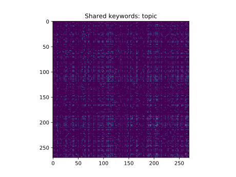

# Drinking with scientists

## Why?
2020-03-20: Sarafina Nance [proposes](https://twitter.com/starstrickenSF/status/1240731356675489794) a Drunk Science Q&A show on [Youtube](https://www.youtube.com/watch?v=11JXEkmhmB8&t=3106s). 300+ people sign up to the [spreadsheet](https://docs.google.com/spreadsheets/d/1-Kigic7VoXzO31rXyLOSE4d9fQb3ZrNfplc1XC_MYmc/edit)

Yours truly finds a new COVID lockdown procrastination: Matchmaking people based on shared keywords. This could be used to find good pairings of people with a lot of field knowledge in common, or to put people together who have very little connection to each others' fields. Or just to make cool pictures. It's probably faster to do this by reading the spreadsheet, but it was fun at the time?

## "Results"

The strongest pairings (most shared keywords) are in `field_of_study_pairs` and `topic_of_interest_pairs`. The most commonly occurring words, other than common english words, are in `field_of_study_words` and `topic_of_interest_words.`

The top ten (counts,topics) were:
84,science
37,anything
27,why
27,space
19,data
18,stem
16,ecology
16,general
16,physics
16,research

The top ten (counts, field of study) were

51,science
28,biology
25,ecology
22,physics
20,neuroscience
17,engineering
12,space
11,astrophysics
10,chemistry
9,education

## Are you done yet?

Well, maybe. You can also use this to look at clusterings in bodies of literature, for example. You can also extend to look at word-pairs (distinguishing social science from materials science, for instance, or identifying 'climate change'). There are probably many things you could do better as this was a real hack of a project.
